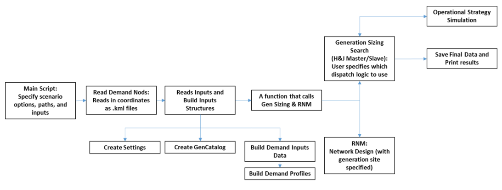

# test-repo

# LREM - Local Reference Electrification Model

LREM is an adaptation of REM \(Reference Electrification Model\) for local electrification planning.  LREM seeks to aid developers in making viable decisions regarding microgrid design by providing the analytics needed to conduct technical and financial explorations

## Inputs required for LREM

- Geographic coordinates of demand nodes
- The consumer type of each node
- Demand inputs for each type of consumer
- Hourly PV insolation data
- Hourly temperature data
- Discount rate
- A generation catalog
- A network catalog

## Outputs of LREM

- The optimal generation mix
- Estimates of operational performance
- The distribution network design
- Financial estimates

## Generalized Workflow of LREM

1. Inputs and settings building
2. Generation Investment
3. Network Design
4. Results Output

Figure Showing the Utilization Sequence of LREM

## Running LREM

As an initial start to running LREM, consider using the example input files located in /[example-inputs/]/(/examples/).

### Github Repositories

Clone the following repositories.  Each repository should be in a seperate folder, contained within a common folder
- Common Folder
  - [LREM Folder](https://github.com/mattbru/test-repo)
  - [RNM Folder](https://github.com/mattbru/test-repo)
  - [REM Folder](https://github.com/universalaccess/rem)

### Configuring Inputs

The input information will be contained within the Input Folder: lrem/input

The following files should be configured for each run of lrem.  Details on configuration can be found in the lrem/input README.md

1. lrem/Input
  1. Network
  2. Regions
    1. Generation site.kml
    2. Building locations
      1. buildingsType1.kml
	  2. buildingsType2.kml
	  3. buildingsType3.kml
    3. points.xlsx
    4. pvwatts_hourly.csv
  3. RNM_input
    1. caso.caso
	2. catalog.dat
	3. ZonasP.txt
2. config_LREM.xlsx
3. demandInputs.xlsx
4. genCatalog.xlsx
5. settings.xlsx

### Running the Model

The below script is used to run the model

[Run_LREM_without_GUI.m](https://github.com/mattbru/test-repo)

### Outputs

Outputs from the model can be found buried within a cascade of subdirectories in the outputs folder

1. In output/Diesel Fraction XX/CNSE XX/your run/ExampleRun_01202016.xlsx, you can find the values for demand met, total expected demand, fraction demand served by diesel
2. Within this folder, there is an "RNM" folder
  1. Shapefiles
  2. resultados.html
3. Numerous Matlab figures will be output.  These can be saved.

